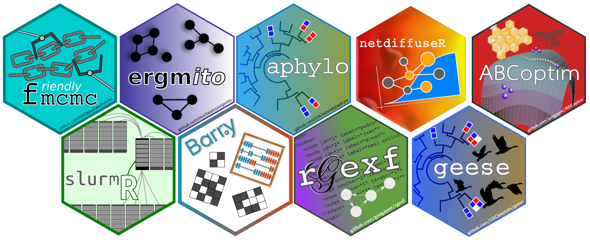

      I am an Assistant Professor of Research at the  <a href="https://medicine.utah.edu/internalmedicine/epidemiology/" target="_blank">Division of Epidemiology at the University of Utah</a>. I work on studying <a href="https://cssociety.org/about-us/what-are-cs" target="_blank">Complex Systems</a> using
        <a href="https://en.wikipedia.org/wiki/Computational_statistics" target="_blank">Statistical Computing</a>. I have over
        ten years of experience developing scientific software focusing on high-performance
        computing, data visualization, and social network analysis. My training is in Public
        Policy (M.A. <a href="https://www.uai.cl/" target="_blank">UAI</a>, 2011), Economics (M.Sc. <a href="https://caltech.edu" target="_blank">Caltech</a>, 2015), and
        Biostatistics (Ph.D. <a href="https://usc.edu" target="_blank">USC</a>, 2020).
      

        I'm available for coding, data science, network science, and data visualization consulting.
      

  <strong>
    <h3>Networks</h3>
<a target="_blank" href="https://github.com/gvegayon/rgexf">rgexf</a> |
<a target="_blank" href="https://github.com/gvegayon/ABCoptim">ABCoptim</a> |
<a target="_blank" href="https://github.com/gvegayon/appliedsnar">Applied with R</a> |
<a target="_blank" href="https://github.com/muriteams/ergmito">ergmito</a> |
<a target="_blank" href="https://github.com/USCCANA/netdiffuseR">netdiffuseR</a> |
    <a target="_blank" href="https://github.com/USCCANA/netplot">netplot</a>
    <h3>Statistical Computing</h3>
<a target="_blank" href="https://github.com/gvegayon/parallel">parallel</a> |
<a target="_blank" href="https://github.com/USCBiostats/fmcmc">fmcmc</a> |
<a target="_blank" href="https://github.com/USCBiostats/slurmR">slurmR</a> |
<a target="_blank" href="https://github.com/USCBiostats/aphylo">aphylo</a> |
<a target="_blank" href="https://github.com/USCBiostats/barry">barry</a> |
<a target="_blank" href="https://github.com/USCBiostats/geese">geese</a> 
    </strong>

 

  latest resume <a href="https://github.com/gvegayon/resume/raw/master/resume.pdf" target="_blank"> here</a> |
  cv <a href="https://github.com/gvegayon/resume/raw/master/cv.pdf" target="_blank">here</a> |
  talks <a href="https://github.com/gvegayon/talks#list-of-talks-and-presentations-" target="_blank"> here</a> 

